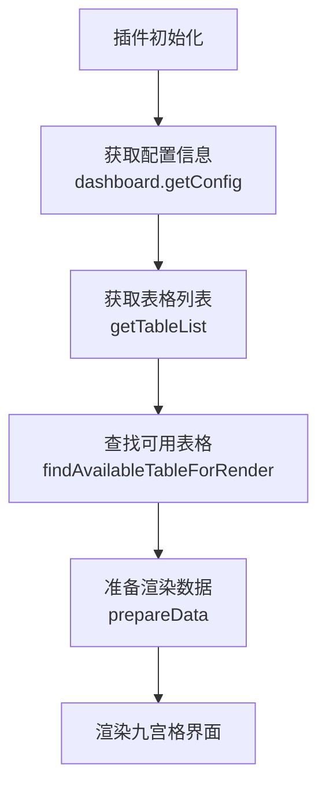

# 人才盘点九宫格插件

## 1. 项目概述

### 1.1 功能介绍
这是一个基于飞书多维表格的人才盘点九宫格可视化插件，使用 React + TypeScript + Vite 构建。该插件将人才数据按照两个维度（通常是能力和潜力）划分到九个格子中，帮助HR和管理者快速识别人才结构，进行人才盘点和管理。

### 1.2 应用场景
- **人才盘点会议**：在季度或年度人才盘点会议中，用于展示组织人才分布情况
- **领导力发展**：识别高潜力、高绩效人才，制定针对性的发展计划
- **组织健康度分析**：通过人才分布直观评估组织健康状况和风险点
- **团队结构优化**：帮助团队负责人了解团队人才构成，进行针对性的招聘和培养

## 2. 数据读取与渲染流程

### 2.1 整体流程

1. **初始化配置**：通过 `App` 组件的 `initConfigData` 方法获取表格配置
   - 调用 `getTableList` 获取可用表格列表
   - 使用 `findAvailableTableForRender` 查找适合渲染的表格
   - 设置默认数据源和配置

2. **数据加载**：使用 `TableDataGroupHelper.loadAllRecordsForTable` 加载表格所有记录
   - 实现分页加载以处理大量数据
   - 累计所有页面数据到 `this.records`

3. **数据处理**：调用 `prepareData` 方法将数据映射到九宫格结构
   - 根据横轴和纵轴配置对记录进行分类
   - 对每个格子内的数据进行分组处理
   - 提取人员信息和统计数据

4. **UI渲染**：通过 `NineSquaresGrid` 组件将九宫格数据渲染到界面
   - 根据主题设置动态调整样式
   - 实现响应式布局，适配不同设备
   - 渲染每个格子的人员信息和统计数据

### 2.2 初始化流程



### 2.3 核心组件

- **App**: 主应用组件，负责初始化和状态管理
  - 使用zustand store管理全局状态
  - 处理数据初始化和加载逻辑
  - 协调不同组件之间的通信

- **TableDataGroupHelper**: 数据处理助手，负责加载和处理表格数据
  - 实现表格数据的分页加载
  - 提供数据分组、过滤和转换功能
  - 支持不同字段类型的数据处理

- **NineSquaresGrid**: 九宫格渲染组件，负责将数据可视化展示
  - 使用CSS Grid实现九宫格布局
  - 支持响应式设计，适配不同屏幕尺寸
  - 实现主题适配和样式定制

- **ConfigPanel**: 配置面板组件，允许用户调整九宫格配置
  - 提供横轴、纵轴、人员字段等配置选项
  - 支持分类映射和分组字段设置
  - 实现配置实时预览功能

### 2.4 状态管理

项目使用zustand进行状态管理，主要有三个store：

1. **useDatasourceStore**: 存储表格数据
   - 保存已加载的表格记录
   - 管理数据加载状态
   - 提供数据更新方法

2. **useDatasourceConfigStore**: 存储数据源配置
   - 保存横轴、纵轴字段配置
   - 管理分类映射关系
   - 提供配置更新接口

3. **useTextConfigStore**: 存储文本配置
   - 管理UI展示相关文本
   - 支持国际化配置
   - 提供文本定制功能

### 2.5 数据获取核心逻辑

数据处理主要在 `TableDataGroupHelper` 类中实现：

1. **数据加载**：通过 `loadAllRecordsForTable()` 方法从飞书表格批量获取所有记录
2. **数据过滤**：使用 `filterRecordsByInfo()` 方法根据横轴和纵轴条件筛选数据
3. **数据分组**：通过 `groupRecordsByInfo()` 方法对筛选后的数据进一步分组
4. **数据映射**：使用 `mapRecordByDisplayInfo()` 方法将记录转换为可显示的格式
5. **九宫格数据准备**：在 `prepareData()` 方法中将处理后的数据分配到九个格子中

## 九宫格数据映射关系详解

### 1. 基本映射架构

九宫格的核心是将人员数据按照两个维度（横轴和纵轴）进行分类，并映射到9个格子中。每个维度通常被分为3个等级：

- **横轴（通常表示能力或绩效）**：左(left)、中(middle)、右(right)
- **纵轴（通常表示潜力或发展）**：上(up)、中(middle)、下(down)

映射关系表：

|          | 左 (left)       | 中 (middle)     | 右 (right)      |
|----------|----------------|-----------------|----------------|
| 上 (up)  | leftUpValue    | middleUpValue   | rightUpValue   |
| 中 (middle) | leftMiddleValue | middleMiddleValue | rightMiddleValue |
| 下 (down) | leftDownValue  | middleDownValue | rightDownValue |

### 2. 维度与分类配置

在 `IDatasourceConfigCacheType` 接口中定义了维度与分类的配置结构：

```typescript
interface IDatasourceConfigCacheType {
    horizontalField: string;    // 横轴字段ID
    horizontalCategories: {     // 横轴分类配置
        left: string[],         // 左分类选项ID列表
        middle: string[],       // 中分类选项ID列表
        right: string[]         // 右分类选项ID列表
    };
    verticalField: string;      // 纵轴字段ID
    verticalCategories: {       // 纵轴分类配置
        up: string[],           // 上分类选项ID列表
        middle: string[],       // 中分类选项ID列表
        down: string[]          // 下分类选项ID列表
    };
    groupField: string;         // 分组字段ID
    personnelField: string;     // 人员字段ID
}
```

### 3.3 维度与分类配置细节

插件使用两个单选字段作为分类维度，每个维度被划分为三个分类：

- **横轴维度** (horizontalField)：
  - 左分类 (left)：包含一组选项ID
  - 中分类 (middle)：包含一组选项ID  
  - 右分类 (right)：包含一组选项ID

- **纵轴维度** (verticalField)：
  - 上分类 (up)：包含一组选项ID
  - 中分类 (middle)：包含一组选项ID
  - 下分类 (down)：包含一组选项ID

### 3. 数据映射核心算法

#### 3.1 记录筛选机制

在 `filterRecordsByInfo` 方法中，实现了基于纵横轴条件的数据筛选：

```typescript
// 纵轴筛选逻辑
filteredRecord = allRecords.filter(item => {
    // 检查记录的垂直字段值是否匹配指定分类的选项ID
    let itemFieldInfo = ((item.fields[verticalField.id]) instanceof Array) ? 
                       (item.fields[verticalField.id] as any[])[0] : 
                       (item.fields[verticalField.id]);
    const itemId = itemFieldInfo ? itemFieldInfo['id'] : ''
    return optionIds.some(id => id === itemId)
})

// 横轴筛选逻辑 (在纵轴筛选基础上进一步筛选)
filteredRecord = filteredRecord.filter(item => {
    // 检查记录的水平字段值是否匹配指定分类的选项ID
    let itemFieldInfo = ((item.fields[horizontalField.id]) instanceof Array) ? 
                       (item.fields[horizontalField.id] as any[])[0] : 
                       (item.fields[horizontalField.id]);
    const itemId = itemFieldInfo ? itemFieldInfo['id'] : ''
    return optionIds.some(id => id === itemId)
})
```

#### 3.2 核心算法实现

九宫格数据映射的核心实现位于 `prepareData` 方法中：

```typescript
public prepareData(config: IDatasourceConfigCacheType): NineSquareGridData {
    // 初始化结果数据结构
    const result: NineSquareGridData = {
        // ... 初始化九个格子的数据
    };
    
    // 遍历九个格子的所有组合
    const nineSquares = [
        { horizontal: 'left', vertical: 'up', field: 'leftUpValue' },
        { horizontal: 'middle', vertical: 'up', field: 'middleUpValue' },
        { horizontal: 'right', vertical: 'up', field: 'rightUpValue' },
        // ... 其他格子
    ];
    
    // 为每个格子处理数据
    nineSquares.forEach(square => {
        // 1. 过滤符合该格子条件的记录
        const filteredRecords = this.filterRecordsByInfo(
            this.records,
            square.horizontal,
            square.vertical,
            config
        );
        
        // 2. 根据分组字段对记录进行分组
        const groupedRecords = this.groupRecordsByInfo(filteredRecords, config.groupField);
        
        // 3. 提取显示信息
        const displayInfo = this.mapRecordByDisplayInfo(
            groupedRecords,
            config.personnelField,
            config.groupField
        );
        
        // 4. 更新结果数据
        result[square.field] = displayInfo;
    });
    
    return result;
}
```


每个格子的数据结构：
```typescript
{
  total: number,          // 格子内总人数
  percent: number,        // 占总数的百分比
  list: [                 // 分组列表
    {
      category: string,   // 分组名称
      persons: string[]   // 该分组下的人员列表
    },
    // 更多分组...
  ]
}
```

### 4. 分组与展示逻辑

#### 4.1 分组字段处理

插件支持通过 `groupField` 在每个格子内对人员进一步分组：

1. `groupTextsFor` 方法获取所有可能的分组值：
   - 对于单选字段：直接从字段属性获取所有选项名称
   - 对于其他字段类型：遍历记录提取所有唯一值

2. `groupRecordsByInfo` 方法根据分组值将记录分组：
   ```typescript
   groupTexts.forEach(text => {
       // 筛选出匹配当前分组值的记录
       let filteredList = records.filter(item => {
           let itemFieldInfo = ((item.fields[groupField.id]) instanceof Array) ? 
                              (item.fields[groupField.id] as any[])[0] : 
                              (item.fields[groupField.id]);
           const itemText = itemFieldInfo ? itemFieldInfo['text'] : ''
           return text === itemText
       })
       // 添加到分组列表
       groupList.push({ category: text, persons: filteredList })
   });
   ```

#### 4.2 人员信息提取

`mapRecordByDisplayInfo` 方法负责从记录中提取人员信息并计算统计数据：

```typescript
groupedRecords.filter(group => group.persons.length > 0).forEach(group => {
    let list: string[] = [];
    // 提取每个记录中的人员名称
    group.persons.forEach(item => {
        let itemFieldInfo = ((item.fields[personnelField.id]) instanceof Array) ? 
                           (item.fields[personnelField.id] as any[])[0] : 
                           (item.fields[personnelField.id]);
        const fieldKey = this.fieldTextKey(personnelField.type); // 根据字段类型确定键名
        const itemText = itemFieldInfo ? itemFieldInfo[fieldKey] : ''
        if (itemText) list.push(itemText)
    })
    // 添加到显示信息列表
    displayInfo.push({ category: group.category, persons: list })
});
```

## 数据表结构要求

为了正确显示九宫格，数据表需要满足以下结构要求：

### 必要字段

1. **人员字段**：用于显示在九宫格中的人员信息
   - 支持类型：单选、多选、成员等字段类型
   - 作用：在每个格子中显示具体的人员名称

2. **横轴维度字段**：用于将人员分到左、中、右三个区域
   - 支持类型：单选字段（推荐）
   - 作用：根据字段值将人员映射到横轴的三个分类中

3. **纵轴维度字段**：用于将人员分到上、中、下三个区域
   - 支持类型：单选字段（推荐）
   - 作用：根据字段值将人员映射到纵轴的三个分类中

4. **分组字段**（可选）：用于在格子内进一步对人员进行分组
   - 支持类型：单选、多选等字段类型
   - 作用：在每个格子内部将人员按照指定维度进一步分类显示

### 字段配置与映射规则

1. **单选字段映射**：
   - 系统会自动读取单选字段的所有选项
   - 用户可以在配置面板中指定每个选项属于哪个分类（左/中/右或上/中/下）

2. **多选字段处理**：
   - 对于多选字段，系统会将记录匹配到所有符合条件的分类中
   - 可能导致同一人员出现在多个格子中

3. **成员字段处理**：
   - 成员字段用于提取人员信息，通常不用于维度分类
   - 系统会自动提取成员的名称或其他标识信息

### 表格数据格式示例


| 员工姓名 | 能力水平 | 发展潜力 | 部门 |
|--------|--------|--------|-----|
| 张三   | 优秀   | 高     | 技术部 |
| 李四   | 良好   | 中     | 市场部 |
| 王五   | 一般   | 低     | 财务部 |
| 赵六   | 优秀   | 中     | 技术部 |
| 钱七   | 良好   | 高     | 人力资源部 |


### 配置数据结构

配置数据存储在 `IDatasourceConfigType` 接口中：

```typescript
interface IDatasourceConfigType {
    tableId: string;            // 表格ID
    dataRange: string;          // 数据范围
    personnelField: string;     // 人员字段ID
    horizontalField: string;    // 横轴字段ID
    horizontalCategories: {     // 横轴分类配置
        left: string[],         // 左分类选项ID列表
        middle: string[],       // 中分类选项ID列表
        right: string[]         // 右分类选项ID列表
    };
    verticalField: string;      // 纵轴字段ID
    verticalCategories: {       // 纵轴分类配置
        up: string[],           // 上分类选项ID列表
        middle: string[],       // 中分类选项ID列表
        down: string[]          // 下分类选项ID列表
    };
    groupField: string;         // 分组字段ID
}
```

## 5. 代码优化建议

基于对加载耗时和性能瓶颈的分析，以下是具体的优化建议：

### 5.1 数据加载优化
1. **实现分页加载**：修改 `loadAllRecordsForTable` 方法，添加分页参数支持
2. **添加数据缓存**：对已加载的数据进行内存缓存，避免重复请求
3. **实现虚拟滚动**：对于大量数据的格子，使用虚拟滚动技术只渲染可见区域
4. **数据预加载**：在用户浏览当前格子时，预加载相邻格子的数据

### 5.2 数据处理优化
1. **使用更高效的数据结构**：使用Map和Set替代数组操作，提高查找和过滤效率
2. **减少重复计算**：缓存中间结果，避免多次重复计算相同的筛选条件
3. **并行处理数据**：使用Promise.all并行处理九个格子的数据

### 5.3 UI渲染优化
1. **实现懒加载**：初始只渲染部分格子，其他格子在需要时再加载
2. **添加展开/折叠功能**：对于大量人员的格子，提供展开/折叠功能
3. **优化动画效果**：减少不必要的重渲染，优化CSS动画性能

### 5.4 代码结构优化
1. **模块化重构**：将复杂功能拆分为更小的模块，提高代码可维护性
2. **添加错误处理**：完善异常捕获和边界条件处理
3. **增加单元测试**：为核心功能添加单元测试，提高代码质量

## 6. 使用示例

### 6.1 基本配置步骤

1. **准备数据表**：
   - 创建符合要求的数据表，包含至少一个人员字段和两个单选字段
   - 确保表格中已有实际数据

2. **配置维度字段**：
   - 选择横轴字段（如：能力水平）
   - 选择纵轴字段（如：发展潜力）
   - 选择人员字段（用于显示姓名）
   - 可选：设置分组字段（如：部门）

3. **设置分类映射**：
   - 为横轴字段的每个选项指定分类（左/中/右）
   - 为纵轴字段的每个选项指定分类（上/中/下）
   - 例如：能力水平字段中，"优秀"映射到"右"，"良好"映射到"中"，"一般"映射到"左"

4. **保存并查看**：
   - 保存配置设置
   - 查看九宫格可视化效果
   - 根据需要调整配置

### 6.2 典型应用场景

1. **人才盘点**：
   - 横轴：能力水平（左：一般，中：良好，右：优秀）
   - 纵轴：发展潜力（下：低，中：中，上：高）
   - 用途：识别高潜力高绩效人才，制定人才发展计划

2. **绩效分析**：
   - 横轴：工作表现（左：需改进，中：符合预期，右：超出预期）
   - 纵轴：团队协作（下：需提升，中：良好，上：优秀）
   - 用途：评估员工综合表现，制定绩效管理策略

3. **团队分析**：
   - 横轴：团队协作能力（左：低，中：中，右：高）
   - 纵轴：技术能力（下：初级，中：中级，上：高级）
   - 用途：优化团队结构，平衡技术能力和团队协作

4. **职业发展**：
   - 横轴：当前技能水平（左：初级，中：中级，右：高级）
   - 纵轴：职业发展速度（下：稳定，中：良好，上：快速）
   - 用途：规划员工职业发展路径，提供个性化培养方案

## 7. 技术栈

- **前端框架**：React 18
- **编程语言**：TypeScript
- **构建工具**：Vite
- **状态管理**：Zustand
- **UI组件库**：Semi UI
- **数据处理**：原生JavaScript数组操作与映射
- **样式方案**：CSS Grid + Flexbox + 响应式设计

## 8. 开发与构建

### 8.1 环境准备

1. **Node.js**：需要 Node.js 16.x 或更高版本
2. **npm 或 yarn**：包管理工具
3. **飞书开放平台开发者账号**：用于开发和测试插件

### 8.2 安装与运行

```bash
# 克隆代码库
git clone <repository-url>
cd nine-squares-grid

# 安装依赖
npm install
# 或使用 yarn
yarn install

# 开发环境运行
npm run dev
# 或使用 yarn
yarn dev

# 构建生产版本
npm run build
# 或使用 yarn
yarn build

# 预览构建结果
npm run preview
# 或使用 yarn
yarn preview
```

### 8.3 调试与测试

1. **本地调试**：
   - 运行 `npm run dev` 启动本地开发服务器
   - 在浏览器中访问提供的本地地址
   - 进行代码修改后，浏览器会自动刷新

2. **飞书环境测试**：
   - 构建项目：`npm run build`
   - 将构建产物部署到飞书开放平台
   - 在飞书多维表格中进行测试

### 8.4 部署指南

1. **构建产物**：
   - 构建完成后，产物位于 `dist` 目录
   - 包含静态资源（HTML、CSS、JavaScript）

2. **部署方式**：
   - 可以部署到任意静态文件服务器
   - 按照飞书插件开发文档配置插件信息
   - 完成插件的审核和发布流程

3. **版本管理**：
   - 建议使用语义化版本号管理
   - 每次发布前更新版本号
   - 维护变更日志